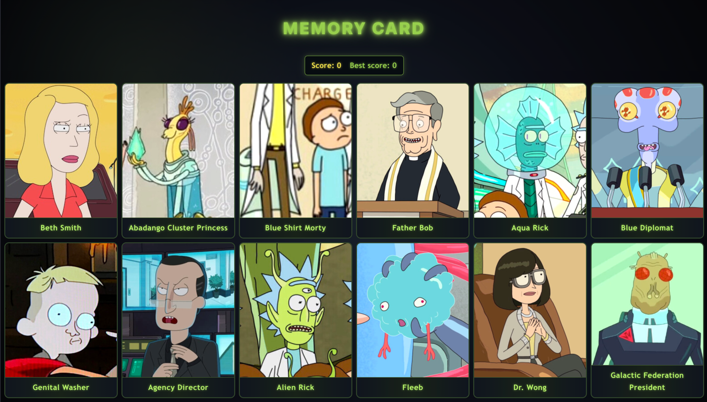

# 🧠 Memory Card Game — Rick and Morty Edition

A memory card game built with React, where the goal is to click each card only once. Click a card you've already clicked, and it's game over — your score resets. Get through all the cards without repeating a click, and you beat your own record.

This project was built as part of **[The Odin Project](https://www.theodinproject.com/)** curriculum — Node.js path, "Memory Card" project — to practice React hooks (`useState`, `useEffect`), fetching data from an external API, and managing component state.

🔗 **Live demo: https://memory-card-game-rho-rose.vercel.app/



---

## 🎮 How to play

1. Click on any card.
2. If it's a card you haven't clicked yet this round, your score goes up by 1, and the cards shuffle.
3. If you click a card you've already clicked, your score resets to 0.
4. Try to beat your **Best Score**, which is saved even after you refresh the page.

---

## 🛠️ Built with

- **React** — component structure, hooks (`useState`, `useEffect`)
- **Vite** — build tool / dev server
- **[Rick and Morty API](https://rickandmortyapi.com/)** — fetches character images and names
- **CSS** — custom Rick and Morty themed styling
- **localStorage** — persists the best score between sessions

---

## ✨ Features

- Fetches a set of random, unique characters from the Rick and Morty API on every load
- Cards shuffle (Fisher-Yates algorithm) after every click
- Live scoreboard: current score + all-time best score
- Best score persists across page reloads via `localStorage`
- Responsive grid layout, fills the full width of the screen
- Rick and Morty themed visual style

---

## 📂 Project structure

```
src/
├── components/
│   ├── Card.jsx        # single card: image + name + click handler
│   ├── CardGrid.jsx     # renders the grid of Card components
│   └── Scoreboard.jsx   # displays current score and best score
├── App.jsx               # main state, data fetching, game logic
├── App.css               # styling
└── main.jsx
```

---

## 🚀 Running locally

```bash
git clone https://github.com/maraaaparaaa/memory-card-game.git
cd memory-card
npm install
npm run dev
```

The app will be available at `http://localhost:5173` (default Vite port).

---

## 📚 What I practiced in this project

- Managing multiple pieces of state with `useState`
- Fetching data from an external API asynchronously (`async`/`await`, `Promise.all`)
- Using `useEffect` correctly — including avoiding common pitfalls like calling `setState` synchronously inside an effect
- Lifting state up and passing data/handlers through props
- Implementing the Fisher-Yates shuffle algorithm
- Persisting data across sessions with `localStorage`
- Basic responsive CSS with Grid and Flexbox

---

## 📄 License

This project is open source and available for learning purposes, built as part of [The Odin Project](https://www.theodinproject.com/) curriculum.